# DevOPS D1 REPORT

## Part 1. Установка ОС

- Установить Ubuntu 20.04 Server LTS без графического интерфейса. (Используем программу для виртуализации - VirtualBox)
- Графический интерфейс должен отсутствовать.
Узнайте версию Ubuntu, выполнив команду
- cat /etc/issue.
- Вставьте скриншот с выводом команды.

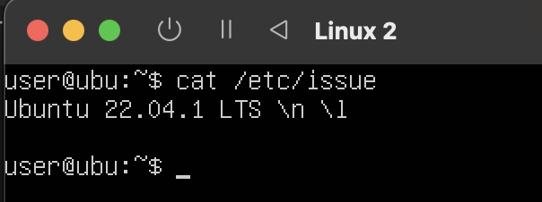

## Part 2. Создание пользователяPart 1. Установка ОС

- Создать пользователя, отличного от пользователя, который создавался при установке. - Пользователь должен иметь разрешение на прочтение логов из папки /var/log.
- Вставьте скриншот вызова команды для создания пользователя.
- Новый пользователь должен быть в выводе команды
cat /etc/passwd
- Вставьте скриншот с выводом команды.

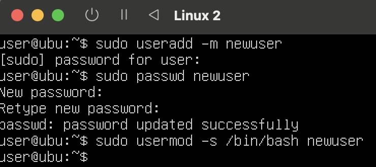
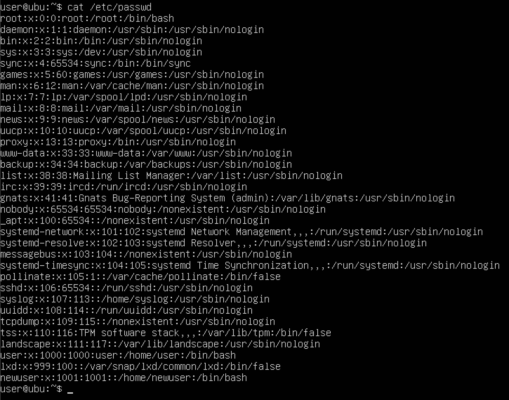

## Part 3. Настройка сети ОС

== Задание ==

- Задать название машины вида user-1
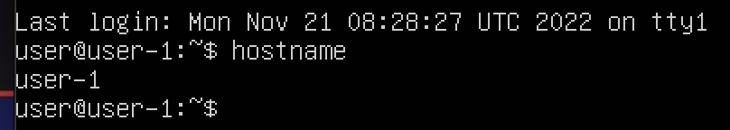
- 1. sudo nano /etc/hostname
- 2. sudo nano /etc/hosts
- 3. sudo reboot

- Установить временную зону, соответствующую вашему текущему местоположению.
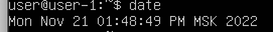

- sudo timedatectl set-timezone Europe/Moscow

- Вывести названия сетевых интерфейсов с помощью консольной команды.
- Все файлы устройств сетевых интерфейсов находятся в папке /sys/class/net. Поэтому вы можете посмотреть её содержимое:

- ls /sys/class/net

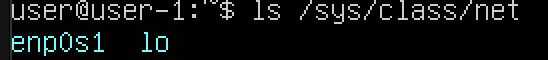

- В отчёте дать объяснение наличию интерфейса lo.
- Сетевые интерфейсы проводного интернета Ethernet обычно имеют имя, начинающиеся с символов enp, например, enp3s0. Такое именование используется только если ваш дистрибутив использует systemd, иначе будет применена старая система именования, при которой имена начинаются с символов eth, например eth0. Беспроводные сетевые интерфейсы, обычно называются wlp или wlx при использовании systemd, например, wlp3s0. Без использования systemd имя беспроводного интерфейса будет начинаться с wlan, например wlan0. Все остальные интерфейсы обычно виртуальные. Один из самых основных виртуальных интерфейсов - lo. Это локальный интерфейс, который позволяет программам обращаться к этому компьютеру.

- Используя консольную команду получить ip адрес устройства, на котором вы работаете, от DHCP сервера.

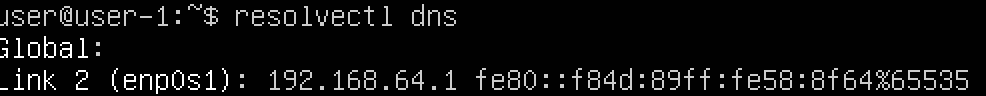

- В отчёте дать расшифровку DHCP. Dynamic Host Configuration Protocol (DHCP).
DHCP — это протокол прикладного уровня, который помогает назначать IP-адреса устройствам при подключении к серверу. Протокол DHCP автоматизирует выдачу адресов, а также их передачу следующим пользователям после отключения устройств или их перехода из одной подсети в другую.

- Определить и вывести на экран внешний ip-адрес шлюза (ip) и внутренний IP-адрес шлюза, он же ip-адрес по умолчанию (gw).

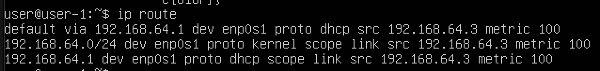

- Задать статичные (заданные вручную, а не полученные от DHCP сервера) настройки ip, gw, dns (использовать публичный DNS серверы, например 1.1.1.1 или 8.8.8.8).

- Требуется открыть /etc/network/interfaces  файл снова и добавить строку dns-nameservers 8.8.8.8 сразу после линии шлюза.

- sudo nano /etc/network/interfaces

- auto lo eth0

- iface lo inet loopback

- iface eth0 inet static

        address xxx.xxx.xxx.xxx(enter your ip here)

        netmask xxx.xxx.xxx.xxx

        gateway xxx.xxx.xxx.xxx(enter gateway ip here,usually the address of the router)

        dns-nameservers 8.8.8.8

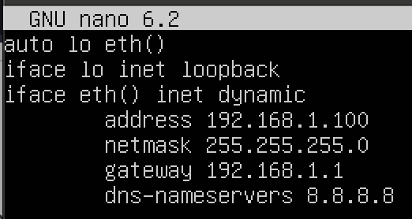

- Перезагрузить виртуальную машину. Убедиться, что статичные сетевые настройки (ip, gw, dns) соответствуют заданным в предыдущем пункте.

- Успешно пропинговать удаленные хосты 1.1.1.1 и ya.ru и вставить в отчёт скрин с выводом команды.

- sudo apt-get install nmap
- Then you can check your entire network for all connected IP addresses by typing in the following:

- nmap -sP IP HERE

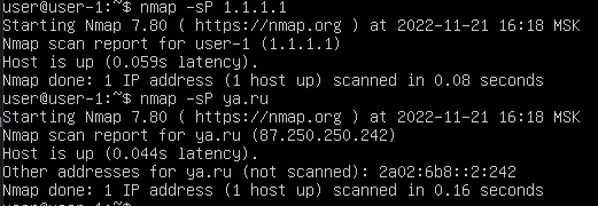

## Part 4. Обновление ОС

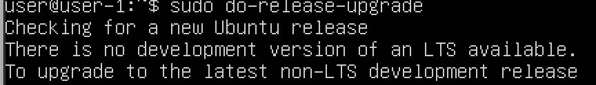

## Part 5. Использование команды sudo

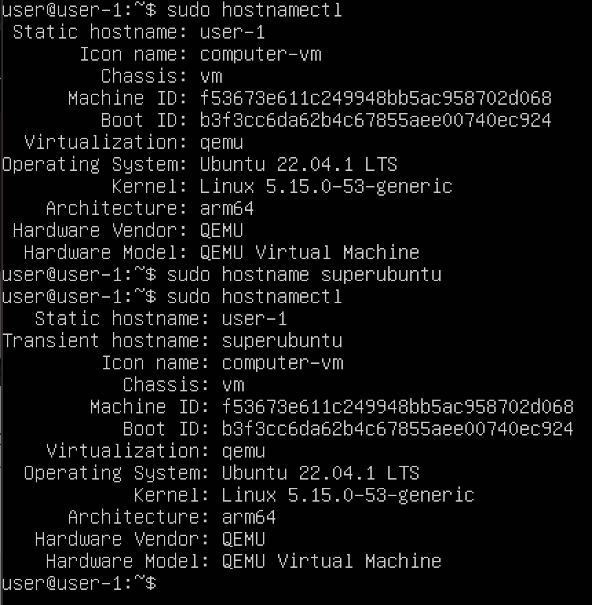

- Substitute User and do, дословно «подменить пользователя и выполнить») — программа для системного администрирования UNIX-систем, позволяющая делегировать те или иные привилегированные ресурсы пользователям с ведением протокола работы.

## Part 6. Установка и настройка службы времени

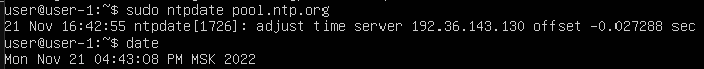

## Part 7. Установка и использование текстовых редакторов

- Используя каждый из трех выбранных редакторов, создайте файл test_X.txt, где X -- название редактора, в котором создан файл. Напишите в нём свой никнейм, закройте файл с сохранением изменений. В отчёт вставьте скриншоты:
Из каждого редактора с содержимым файла перед закрытием.
В отчёте укажите, что сделали для выхода с сохранением изменений.