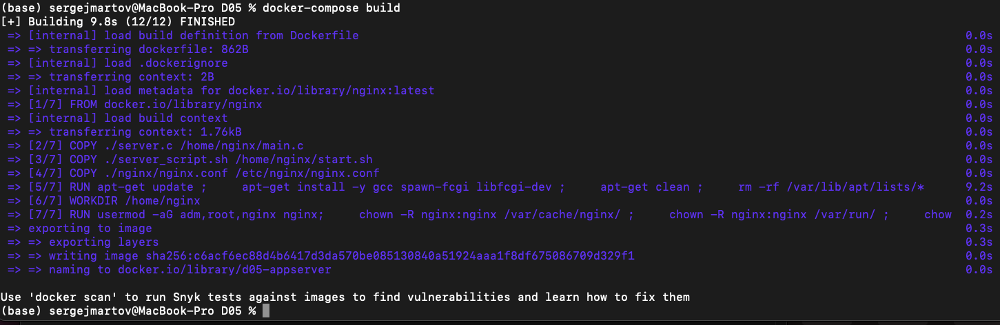

# Part 1. Ready-made docker
- As the final goal of your little practice you have immediately chosen to write a docker image for your own web server, so first you need to deal with a ready-made docker image for the server. You chose a pretty simple nginx.

## == Task ==

## Take the official docker image from nginx and download it using docker pull.
## Check that the image is running with docker ps


## Run docker image with docker run -d [image_id|repository]
- docker run -p 80:80 -p 443:443 8a5e3e44915c


## Check that the image is running with docker ps


## View container information with docker inspect [container_id|container_name]


- From the command output define and write in the report the container size, list of mapped ports and container ip
- container size:  1.09kB (virtual 135MB)
- "IPAddress": "172.17.0.3",
- "ExposedPorts": {"443/tcp": {}, "80/tcp": {}

## Stop docker image with docker stop [container_id|container_name]


## Check that the image has stopped with docker ps


## Restart docker container with docker restart [container_id|container_name]
## Check in any way that the container is running


# Part 2. Operations with container

- Docker image and container are ready. Now we can look into nginx configuration and display page status.

## == Task ==

## Read the nginx.conf configuration file inside the docker container with the exec command


- Подключаемся внутрь работающего контейнера с помощью команды docker exec -it 5a8c01ccb9da30f129049c26306e96d9705313dd48a44ec57551b15c022a4f49 bash
- Нужный файл лежит по адресу etc/nginx/ngnix.conf


- Вот что там внутри

## Create a nginx.conf file on a local machine

- Создаем конфиг 
- user  nginx;
worker_processes  auto;
error_log  /var/log/nginx/error.log notice;
pid        /var/run/nginx.pid;
events {
    worker_connections  1024;
}
http {
    server {
        location = /status {
            stub_status on;
        }
    }
}
## Copy the created nginx.conf file inside the docker image using the docker cp command

- Заливаем его внутрь контейнера
- docker cp /Users/sergejmartov/Desktop/nginx.conf reverent_fermat:/etc/nginx/

## Restart nginx inside the docker image with exec

- Перегружаем контейнер
- docker container exec reverent_fermat nginx -s reload

## Check that localhost:80/status returns the nginx server status page


## Export the container to a container.tar file with the export command
- Экспортируем docker export --output="container.tar" reverent_fermat

## Stop the container

- docker container stop reverent_fermat

## Delete the image with docker rmi [image_id|repository]without removing the container first

docker rmi -f 8a5e3e44915c

## Delete stopped container

- docker rm reverent_fermat
 


## Import the container back using the importcommand

- docker import container.tar 

## Run the imported container
## Check that localhost:80/status returns the nginx server status page
- docker run -d -p 80:80 -p 443:443 fd959ecd52f9 /docker-entrypoint.sh nginx -g "daemon off;"
- Службы надо перезапустить в новом контейнере!


# Part 3. Mini web server

## == Task ==

## Write a mini server in C and FastCgi that will return a simple page saying Hello World!
- сервер будет выглядеть вот так
- #include "fcgi_stdio.h"
- #include <stdlib.h>

- int main(void)
- {
    - while(FCGI_Accept() >= 0)
   - {
       - printf("Content-type: text/html\r\nStatus: 200 OK\r\n\r\nHello World!");
    - }

    - return 0;
- }
- Внутрь контейнера надо поставить все необходимые зависимости, чтобы FastCgi работал.
- Логинимся в контейнер docker run -it fd959ecd52f9 bin/bash и устанавливаем все необходимое для работы:
- apt-get install gcc
- apt-get install spawn-fcgi
- apt-get install libfcgi-dev
- копируем файл с проектом в контейнер docker cp /Users/sergejmartov/Documents/21/Devops/D05/hello.c reverent_rubin:/home 
-  компилим и запускаем gcc -o hello hello.c -lfcgi и spawn-fcgi -p 8080 ./hello

## Write your own nginx.conf that will proxy all requests from port 81 to 127.0.0.1:8080
- в nginx.conf в папке etc/nginx/nginx.conf записываем новый конфиг для мапинга 81 порта
- user  nginx;
worker_processes  auto;

error_log  /var/log/nginx/error.log notice;
pid        /var/run/nginx.pid;


events {
    worker_connections  1024;
}


http {
    server {
        listen 81;
        listen [::]:81;

        location / {
            fastcgi_pass 127.0.0.1:8080;
        }
    }

    include       /etc/nginx/mime.types;
    default_type  application/octet-stream;

    log_format  main  '$remote_addr - $remote_user [$time_local] "$request" '
                      '$status $body_bytes_sent "$http_referer" '
                      '"$http_user_agent" "$http_x_forwarded_for"';

    access_log  /var/log/nginx/access.log  main;

    sendfile        on;

    keepalive_timeout  65;
}
  


- останавливаем контейнер docker stop
- создаем на базе контейнера новый образ docker commit reverent_rubin neocon
- перезапускаем его с маппингом 81 порта.


- опять запускаем внутри свой файл Hello World
- spawn-fcgi -p 8080 ./hello
-  Теперь по localhost:81 есть Hello World


## Put the nginx.conf file under ./nginx/nginx.conf (you will need this later)

В папку ./nginx/nginx.conf копируем наш конфиг

# Part 4. Your own docker

- Write your own docker image that:
- 1) builds mini server sources on FastCgi from [Part 3](#part-3-mini- web-server)
- 2) runs it on port 8080
- 3) copies inside the image written ./nginx/nginx.conf
- 4) runs nginx.
- nginx can be installed inside the docker itself, or you can use a ready-made image with nginx as base.

Мой dockerfile

- FROM nginx
- RUN apt-get -y update
- RUN apt-get install nano -y
- COPY hello.c ./
- COPY nginx.conf /etc/nginx/
- RUN apt-get install gcc -y
- RUN apt-get install spawn-fcgi
- RUN apt-get install libfcgi-dev -y
- RUN gcc -o hello ./hello.c -lfcgi 
- RUN spawn-fcgi -p 8080 ./hello

Создаем образ через команду docker build -t custom .
# Build the written docker image with docker build, specifying the name and tag
# Check with docker images that everything is built correctly
# Run the built docker image by mapping port 81 to 80 on the local machine and mapping the ./nginx folder inside the container to the address where the nginx configuration files are located (see Part 2)


- Запускаем и маппим порты
- docker run -p 80:81 -d custom
  
# Check that the page of the written mini server is available on localhost:80


# Part 5. Your own docker

- После написания контейнера никогда не будет лишним проверить его на безопасность.

- == Задание ==

- Просканировать контейнер из предыдущего задания через dockle [container_id|container_name]
dockle -i CIS-DI-0010 custom


- Меняем dockerfile для изменения прав


- Ошибки ушли


# Part 5. Basic Docker Compose

== Task ==

- Write a docker-compose.yml file, using which:
- 1) Start the docker container from Part 5 (it must work on local network, i.e., you don't need to use EXPOSE instruction and map ports to local machine)
- 2) Start the docker container with nginx which will proxy all requests from port 8080 to port 81 of the first container


- docker pull nginx
- docker images
- docker run -d -p 81:81 [images_id]
- docker ps


docker cp server/server.c [container_id]:/server.c
docker cp server/nginx.conf [container_id]:etc/nginx/nginx.conf
- docker exec -it [container_id] bash
```
apt update    
apt-get install libfcgi-dev
apt-get install spawn-fcgi
apt-get install gcc
```

```
gcc server.c -lfcgi -o server
spawn-fcgi -p 8080 ./server
```

```
exit
```

- docker exec [container_id] service nginx start
(и)
- docker exec [container_id] nginx -s reload


ДАЛЕЕ МОЖНО ЗАХОДИТЬ НА localhost:81


Файл docker-compose.yml


Далее можно билдить yml

docker-compose build



И поднимать его
docker-compose up


Check that the browser returns the page you wrote on localhost:80 as before


