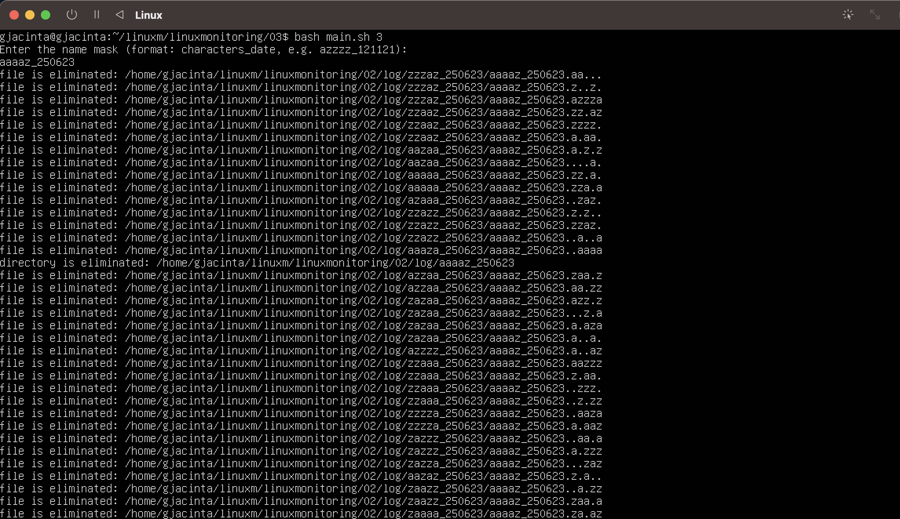
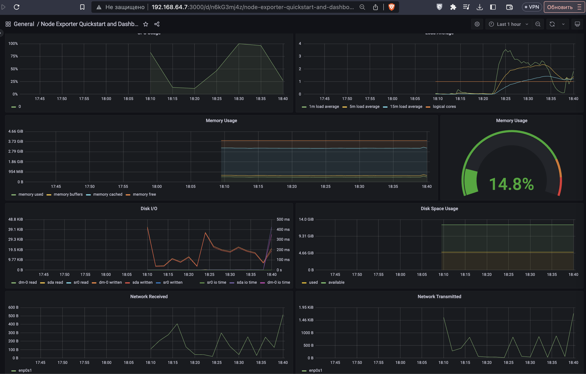

# Part 1. File generator

- == Задание ==

- Написать bash-скрипт. Скрипт запускается с 6 параметрами. Пример запуска скрипта:
  main.sh /opt/test 4 az 5 az.az 3kb
- Параметр 1 - это абсолютный путь.
- Параметр 2 - количество вложенных папок.
- Параметр 3 - список букв английского алфавита, используемый в названии папок (не более 7 знаков).
- Параметр 4 - количество файлов в каждой созданной папке.
- Параметр 5 - список букв английского алфавита, используемый в имени файла и расширении (не более 7 знаков для имени, не более 3 знаков для расширения).
- Параметр 6 - размер файлов (в килобайтах, но не более 100).
- Имена папок и файлов должны состоять только из букв, указанных в параметрах, и использовать каждую из них хотя бы 1 раз.
- Длина этой части имени должна быть от 4 знаков, плюс дата запуска скрипта в формате DDMMYY, отделённая нижним подчёркиванием, например:
  ./aaaz_021121/, ./aaazzzz_021121
- При этом, если для имени папок или файлов были заданы символы az, то в названии файлов или папок не может быть обратной записи:
  ./zaaa_021121/, т.е. порядок указанных символов в параметре должен сохраняться.
- При запуске скрипта в указанном в параметре 1 месте, должны быть созданы папки и файлы в них с соответствующими именами и размером.
- Скрипт должен остановить работу, если в файловой системе (в разделе /) останется 1 Гб свободного места.
- Записать лог файл с данными по всем созданным папкам и файлам (полный путь, дата создания, размер для файлов).

## 1.Создание лог-файла

## 2.Корректная работа

## 3.Размер файла превышает 100 килобайт

## 4.Количество файлов указано не числом

## 5.Нет аргументов

# Part 2. File system clogging

- == Задание ==

- Написать bash-скрипт. Скрипт запускается с 3 параметрами. Пример запуска скрипта:
  main.sh az az.az 3Mb
- Параметр 1 - список букв английского алфавита, используемый в названии папок (не более 7 знаков).
- Параметр 2 - список букв английского алфавита, используемый в имени файла и расширении (не более 7 знаков для имени, не более 3 знаков для расширения).
- Параметр 3 - размер файла (в Мегабайтах, но не более 100).
- Имена папок и файлов должны состоять только из букв, указанных в параметрах, и использовать каждую из них хотя бы 1 раз.
- Длина этой части имени должна быть от 5 знаков, плюс дата запуска скрипта в формате DDMMYY, отделённая нижним подчёркиванием, например:
  ./aaazz_021121/, ./aaazzzz_021121
- При этом, если для имени папок или файлов были заданы символы az, то в названии файлов или папок не может быть обратной записи:
  ./zaaa_021121/, т.е. порядок указанных в параметре символов должен сохраняться.
- При запуске скрипта, в различных (любых, кроме путей содержащих bin или sbin) местах файловой системы, должны быть созданы папки с файлами.
- Количество вложенных папок - до 100. Количество файлов в каждой папке - случайное число (для каждой папки своё).
- Скрипт должен остановить работу, когда в файловой системе (в разделе /) останется 1 Гб свободного места.
- Свободное место в файловой системе определять командой: df -h /
- Записать лог файл с данными по всем созданным папкам и файлам (полный путь, дата создания, размер для файлов).
- В конце работы скрипта, вывести на экран время начало работы скрипта, время окончания и общее время его работы. Дополнить этими данными лог файл.

## 1.Создание лог-файла

## 2.Корректная работа

## 3.Обработка ошибок

# Part 3. Cleaning the file system

- == Задание ==

- Написать bash-скрипт. Скрипт запускается с 1 параметром. Скрипт должен уметь очистить систему от созданных в засорение файловой системы папок и файлов 3 способами:

- По лог файлу
- По дате и времени создания
- По маске имени (т.е. символы, нижнее подчёркивание и дата).
- Способ очистки задается при запуске скрипта, как параметр со значением 1, 2 или 3.

- При удалении по дате и времени создания, пользователем вводятся времена начала и конца с точностью до минуты. Удаляются все файлы, созданные в указанном временном промежутке. Ввод может быть реализован как через параметры, так и во время выполнения программы.

## 1. Трем содержимое по данным лог-файла

## 2. Ошибки

-отсутствует лог-файл

- нет аргументов
- неправильный тип очистки

## 3. Очистка по времени

## 4. Очистка по маске

# Part 4. LOG generator

== Задание ==

- Написать bash-скрипт или программу на Си, генерирующий 5 файлов логов nginx в combined формате.

- Каждый лог должен содержать информацию за 1 день.

- За день должно быть сгенерировано случайное число записей от 100 до 1000.

- Для каждой записи должны случайным образом генерироваться:

- IP (любые корректные, т.е. не должно быть ip вида 999.111.777.777)
- Коды ответа (200, 201, 400, 401, 403, 404, 500, 501, 502, 503)
- Методы (GET, POST, PUT, PATCH, DELETE)
- Даты (в рамках заданного дня лога, должны идти по увеличению)
- URL запроса агента
- Агенты (Mozilla, Google Chrome, Opera, Safari, Internet Explorer, Microsoft Edge, Crawler and bot, Library and net tool)
- В комментариях в вашем скрипте/программе указать, что означает каждый из использованных кодов ответа.

- КОДЫ:
- 200: OK
- 201: Created
- 400: Bad Request
- 401: Unauthorized
- 403: Forbidden
- 404: Not Found
- 500: Internal Server Error
- 501: Not Implemented
- 502: Bad Gateway
- 503: Service Unavailable

# Part 5. Monitoring

- == Задание ==
- Написать bash-скрипт для разбора логов nginx из Части 4 через awk.
- Скрипт запускается с 1 параметром, который принимает значение 1, 2, 3 или 4.
- В зависимости от значения параметра вывести:

- Все записи, отсортированные по коду ответа
- Все уникальные IP, встречающиеся в записях
- Все запросы с ошибками (код ответа - 4хх или 5хх)
- Все уникальные IP, которые встречаются среди ошибочных запросов

## 1. Все записи, отсортированные по коду ответа

## 2. Все уникальные IP, встречающиеся в записях

## 3. Все запросы с ошибками (код ответа - 4хх или 5хх)

## 3. Все уникальные IP, которые встречаются среди ошибочных запросов

## 3. Ошибки

# Part 6. GoAccess

- == Задание ==
- С помощью утилиты GoAccess получить ту же информацию, что и в Части 5
- Открыть веб интерфейс утилиты на локальной машине.

# Part 7. Grafana and Prometheus

== Задание ==

- Установить и настроить Prometheus и Grafana на виртуальную машину

- Получить доступ к веб интерфейсам Prometheus и Grafana с локальной машины

- Добавить на дашборд Grafana отображение ЦПУ, доступной оперативной памяти, свободное место и кол-во операций ввода/вывода на жестком диске

- Запустить ваш bash-скрипт из Части 2

- Посмотреть на нагрузку жесткого диска (место на диске и операции чтения/записи)

- Установить утилиту stress и запустить команду stress -c 2 -i 1 -m 1 --vm-bytes 32M -t 10s

- Посмотреть на нагрузку жесткого диска, оперативной памяти и ЦПУ

## Prometheus

- устанавливаю prometheus - wget + https://github.com/prometheus/prometheus/releases/download/v2.39.1/prometheus-2.39.1.linux-amd64.tar.gz**
- распакуем архив **tar xfv prometheus-2.39.1.linux-arm64.tar.gz;**
- создаем две папки куда все будем перемещать **sudo mkdir -p /var/lib/prometheus** и **sudo mkdir -p /etc/prometheus**
- переходим в разархивированную папку и распределяем файлы по заданным каталогам
- **sudo cp prometheus promtool /usr/local/bin/** && **sudo cp -r console_libraries consoles prometheus.yml /etc/prometheus**
- Создать пользователя от чьего имени будем запускать прометеус. **useradd --no-create-home --shell /bin/false prometheus**

> --no-create-home - не создает домашнюю директорию
> --shell /bin/false - как я понимаю нельзя логиниться как прометеус

- назначим пользователя prometheus хозяином каталогов и файлов
- **sudo chown -R prometheus:prometheus /etc/prometheus/ /var/lib/prometheus** && **sudo chown prometheus:prometheus /usr/local/bin/{prometheus,promtool}**
- **sudo nano /etc/systemd/system/prometheus.service** - автоматизируем запуск через systems

- vim /etc/systemd/system/prometheus.service
- [Unit]
- Description=Prometheus
- Wants=network-online.target
- After=network-online.target

- [Service]
- User=prometheus
- Group=prometheus
- Type=simple
- ExecStart=/usr/local/bin/prometheus \
- --config.file /etc/prometheus/prometheus.yml \
- --storage.tsdb.path /var/lib/prometheus/ \
- --web.console.templates=/etc/prometheus/consoles \
- --web.console.libraries=/etc/prometheus/console_libraries

- [Install]
- WantedBy=multi-user.target

- -config.file - путь к главному конфигурацию файлу промеуса
- -storage.tsdb.path - где хранятся данные (потом отдельно где templates и libraries)
- -web.listen-address - позволяет слушать на всех сетевых интерфейсах

- ЗАПУСКАЕМ ПРОМЕТЕУС
- sudo systemctl enable prometheus
- sudo systemctl start prometheus
- sudo systemctl status prometheus\*\*

- http://192.168.64.7:9090 - (айпи виртуальный машины+порт) переходим и получаем веб интерфейс промеуса с локалки
  

## Grafana

- wget https://dl.grafana.com/oss/release/grafana_9.2.4_arm64.deb**
- sudo dpkg -i grafana_9.2.4_arm64.deb\*\*
- sudo systemctl enable grafana-server\*\*
- sudo systemctl start grafana-server\*\*
- sudo systemctl status grafana-server\*\*

## Node-Exporter

- качаем архив, распаковываем.
- sudo useradd --no-create-home --shell /bin/false node_exporter - добавим пользователя и для нода
- sudo nano /etc/systemd/system/node_exporter.service

- vim /etc/systemd/system/node_exporter.service
  [Unit]
  Description=Node Exporter
  Wants=network-online.target
  After=network-online.target

StartLimitIntervalSec=500
StartLimitBurst=5

[Service]
User=node_exporter
Group=node_exporter
Type=simple
Restart=on-failure
RestartSec=5s
ExecStart=/usr/local/bin/node_exporter \
--collector.logind

[Install]
WantedBy=multi-user.target

- sudo systemctl enable node_exporter
- sudo systemctl start node_exporter
- sudo systemctl status node_exporter
- Добавляем в yml Прометеуса
- sudo vim /etc/prometheus/prometheus.yml

- - job_name: "node_export"
-      static_configs:
-         - targets: ["localhost:9100"]

- Датапоинты видны
  

- Получить доступ к веб интерфейсам Prometheus и Grafana с локальной машины
- Добавить на дашборд Grafana отображение ЦПУ, доступной оперативной памяти, свободное место и кол-во операций ввода/вывода на жестком диске

  

- Запустить ваш bash-скрипт из Части 2
- Посмотреть на нагрузку жесткого диска (место на диске и операции чтения/записи)
  

- Установить утилиту stress и запустить команду stress -c 2 -i 1 -m 1 --vm-bytes 32M -t 10s
- Посмотреть на нагрузку жесткого диска, оперативной памяти и ЦПУ
  

# Part 8. Dashboard

== Задание ==

Установить готовый дашборд Node Exporter Quickstart and Dashboard с официального сайта Grafana Labs

- Готовый дашборд
  

- Проводим те же тесты, что и в Prometheus и Grafana. Запускаем мусорку
  

- Нагрузка после стрес теста stress -c 1 -i 1 -m 1 --vm-bytes 1024M -t 30s

  

- Запускаем ещё одну виртуальную машину, находящуюся в одной сети с текущей
- Запускаем тест нагрузки сети с помощью утилиты iperf3

  

- Смотрим на нагрузку сетевого интерфейса
  

# Part 8. Personal node_exporter

== Задание ==

- Написать bash-скрипт или программу на Си, которая собирает информацию по базовым метрикам системы (ЦПУ, оперативная память, жесткий диск (объем)).
- Скрипт или программа должна формировать html страничку по формату Prometheus, которую будет отдавать nginx.
- Саму страничку обновлять можно как внутри bash-скрипта или программы (в цикле), так и при помощи утилиты cron, но не чаще, чем раз в 3 секунды.
- Поменять конфигурационный файл Prometheus, чтобы он собирал информацию с созданной вами странички.
- Провести те же тесты, что и в Prometheus и Grafana

- 1. Добавляем новый target в prometheus.yml
- sudo vim /etc/prometheus/prometheus.yml

  > ...
  >
  > - job_name: "system_metrics"
  >   static_configs:
  >   - targets: ["localhost:8080"]

- В прометеусе новый источник
  

  - 2. Настройка nginx

- sudo vim /etc/nginx/sites-available/metrics
  

- sudo vim /etc/nginx/sites-available/metrics
- sudo ln -s /etc/nginx/sites-available/metrics /etc/nginx/sites-enabled/metrics
- sudo vim /etc/nginx/nginx.conf

- Заменяем в конфиге include /etc/nginx/sites-enabled/\* на include /etc/nginx/sites-enabled/metrics;

- Запускаем сервисы
- sudo nginx -t
- sudo systemctl start nginx.service
- sudo systemctl start prometheus.service

- Наш сервер
  

- Получаем вывод

  

  Запускаем скрипт из task #2 на мусор

  

  Запускаем стресс тест $ stress -c 1 -i 1 -m 1 --vm-bytes 1024M -t 30s

  
